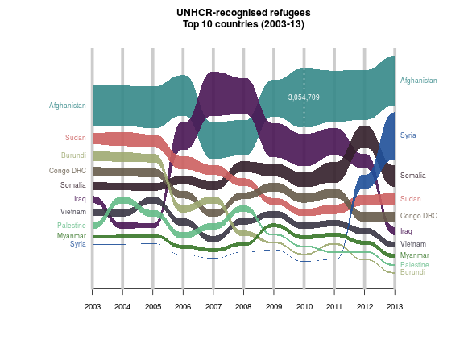

# R package for drawing alluvial diagrams

[](https://travis-ci.org/mbojan/alluvial)
[](https://ci.appveyor.com/project/mbojan/alluvial)
[](http://cranlogs.r-pkg.org/)
[](https://cran.r-project.org/package=alluvial)


What are alluvial diagrams? See for example:

* [Wikipedia](http://en.wikipedia.org/wiki/Alluvial_diagram)
* My [blog post](http://bc.bojanorama.pl/2014/03/alluvial-diagrams) showing-off this package
* Some discussion on [CrossValidated](http://stats.stackexchange.com/questions/12029/is-it-possible-to-create-parallel-sets-plot-using-r)


## Examples

Alluvial diagram of `datasets::Titanic` data made with `alluvial()`. Notice how each category block becomes a stacked barchart showing relative frequency of survivors.


```r
tit <- tibble::as_data_frame(Titanic)

tit %>% head() %>% knitr::kable()
```


|Class |Sex    |Age   |Survived |  n|
|:-----|:------|:-----|:--------|--:|
|1st   |Male   |Child |No       |  0|
|2nd   |Male   |Child |No       |  0|
|3rd   |Male   |Child |No       | 35|
|Crew  |Male   |Child |No       |  0|
|1st   |Female |Child |No       |  0|
|2nd   |Female |Child |No       |  0|

```r
alluvial(
    select(tit, Survived, Sex, Age, Class),
    freq=tit$n,
    col = ifelse(tit$Survived == "Yes", "orange", "grey"),
    border = ifelse(tit$Survived == "Yes", "orange", "grey"),
    layer = tit$Survived != "Yes",
    alpha = 0.8,
    blocks=FALSE
  )
```


Alluvial diagram for multiple time series / cross-sectional data based on `alluvial::Refugees` data made with `alluvial_ts()`.


```r
Refugees %>% head() %>% knitr::kable()
```


|country     | year| refugees|
|:-----------|----:|--------:|
|Afghanistan | 2003|  2136043|
|Burundi     | 2003|   531637|
|Congo DRC   | 2003|   453465|
|Iraq        | 2003|   368580|
|Myanmar     | 2003|   151384|
|Palestine   | 2003|   350568|

```r
set.seed(39) # for nice colours
cols <- hsv(h = sample(1:10/10), s = sample(3:12)/15, v = sample(3:12)/15)

alluvial_ts(Refugees, wave = .3, ygap = 5, col = cols, plotdir = 'centred', alpha=.9,
            grid = TRUE, grid.lwd = 5, xmargin = 0.2, lab.cex = .7, xlab = '',
            ylab = '', border = NA, axis.cex = .8, leg.cex = .7,
            leg.col='white', 
            title = "UNHCR-recognised refugees\nTop 10 countries (2003-13)\n")
```




## Installation

Using "devtools" package:

``` r
devtools::install_github("mbojan/alluvial")

# To have the vignettes build use
devtools::install_github("mbojan/alluvial", build_vignettes=TRUE)
```
